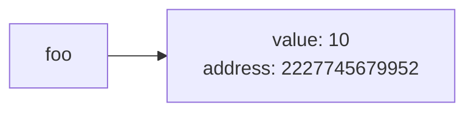
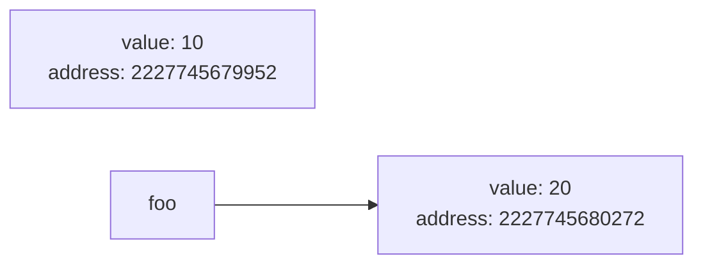
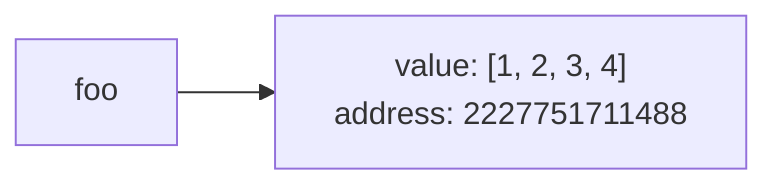
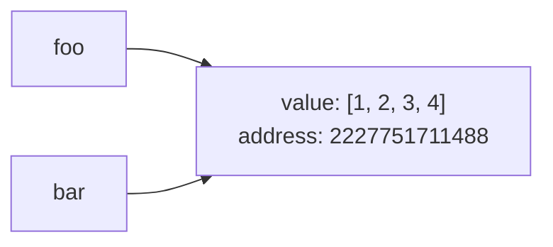
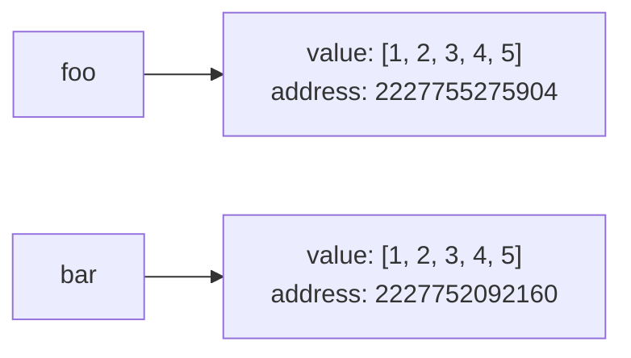
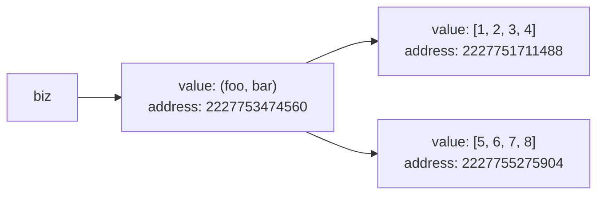
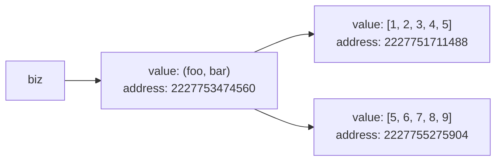

# Mutowalne i niemutowalne typy zmiennych
Podsumowanie: artykuł opisuje, czym są mutowalne i niemutowalne typy zmiennych w Pythonie
## 1. Wprowadzenie
W Pythonie wszystko jest obiektem, również zmienne deklarowane przez nas podczas pisania kodu. Każdy z obiektów posiada swój określony stan. Niektóre typy zmiennych pozwalają na modyfikację swojego stanu. Takie typy nazywamy typami `mutowalnymi`. Jak łatwo się domyślić, istnieją również typy zmiennych, które nie pozwalają na modyfikację swojego stanu. Takie typy nazywamy typami `niemutowalnymi`.

## 2. Zmienne niemutowalne

### a) Przykłady zmiennych niemutowalnych

- int
- float
- bool
- string
- tuple

### b) Zmienne niemutowalne w praktyce

Jak wygląda działanie zmiennych niemutowalnych w praktyce? Załóżmy, że chcemy zadeklarować w Pythonie nową zmienną typu integer. 

```python
>>> foo = 10
```

Przy wykonywaniu tej operacji, Python tworzy w pamięci referencję do obiektu typu integer. Możemy teraz wyświetlić adres tej zmiennej w pamięci poprzez metodę `id()`

```python
>>> id(foo)
2227745679952
```

Widzimy więc, że nasza referencja `foo` wskazuje obecnie na obiekt o adresie w pamięci `2227745679952`.



Załóżmy, że chcemy teraz zmienić wartość zmiennej `foo` na `20`:
```python
>>> foo = 20
>>> id(foo)
2227745680272
```
Jak widzimy, adres zmiennej w pamięci uległ zmianie. Oznacza to, że Python w momencie zmiany wartości, stworzył w pamięci zupełnie nowy obiekt typu integer i teraz referencja `foo` wskazuje na ten właśnie obiekt.



W ten sam sposób zachowają się zmienne typów wymienionych w punkcie 2.a:
```python
>>> foo = 'Python' #zmienna typu string
>>> id(foo)
2227751659120
>>> foo = 'Python learning'
>>> id(foo)
2227752197936
```

```python
>>> foo = 1.23 #zmienna typu float
>>> id(foo)
2227751791472
>>> foo = 2.34
>>> id(foo)
2227751791248
```

```python
>>> foo = True #zmienna typu bool
>>> id(foo)
140735151495272
>>> foo = False
>>> id(foo)
140735151495304
```

```python
>>> foo = (1, 2, 3) #zmienna typu tuple (krotka)
>>> id(foo)
2227752197312
>>> foo = (4, 5, 6)
>>> id(foo)
2227752197952
```

## 3. Zmienne mutowalne
### a) Przykłady zmiennych mutowalnych

- set (zbiór)
- list
- dictionary

### b) Zmienne mutowalne w praktyce
Jak możemy się domyślić, zmienna typu mutowalnego nie zmieni adresu w pamięci po jej modyfikacji. Wypróbujmy teraz wszystkie typy zmiennych z punktu 3.a

```python
>>> bar = {1, 2, 3} #zmienna typu set
>>> id(bar)
2227751977696
>>> bar.add(4) #dodajemy do zbioru kolejną liczbę
>>> id(bar)
2227751977696
```
```python
>>> bar = [1, 2, 3] #zmienna typu list
>>> id(bar)
2227751711104
>>> bar.append(4) #dodajemy do listy kolejną liczbę
>>> id(bar)
2227751711104
```
```python
>>> bar = {"one" : 1, "two" : 2, "three" : 3} #zmienna typu dictionary (słownik)
>>> id(bar)
2227751627264
>>> bar["four"] = 4 #dodajemy do słownika kolejny element
>>> bar
{'one': 1, 'two': 2, 'three': 3, 'four': 4}
>>> id(bar)
2227751627264
```

## 4. Pułapki związane z deklaracją zmiennych
Teraz gdy znamy już różnice między typami mutowalnymi i niemutowalnymi, czas omówić pułapkę związaną z ich deklaracją.

Przyjmijmy, że chcemy zadeklarować zmienną typu list. Wiemy już, że podczas tworzenia zmiennej, Python tworzy w pamięci obiekt z odpowiednią wartością oraz referencją.
```python
>>> foo = [1, 2, 3, 4]
>>> id(foo)
2227751711488
```



Zobaczmy teraz, co się stanie, gdy postanowimy stworzyć kolejną zmienną i przypisać jej wartość zmiennej `foo`

```python
>>> bar = foo
>>> id(bar)
2227751711488
```
Widzimy, że zmienna `bar` wskazuje dokładnie na ten sam obiekt w pamięci, co zmienna `foo`. 



Spróbujmy teraz zmodyfikować zmienną `foo` i wyświetlić wartości obu zmiennych.

```python
>>> foo.append(5) #modyfikujemy zmienną foo
>>> print(foo)
[1, 2, 3, 4, 5]
>>> print(bar)
[1, 2, 3, 4, 5]
```

Tworząc zmienną `bar` tak naprawdę nie stworzyliśmy nowej zmiennej, a jedynie nową referencję do tego samego obiektu w pamięci, na który wskazywała zmienna `foo`. Modyfikując zmienną `foo` lub zmienną `bar` tak naprawdę modyfikujemy ten sam obiekt.

W jaki sposób możemy więc uzyskać kopię zmiennej? Z pomocą przychodzi metoda `copy()`. 

```python
>>> foo = [1, 2, 3, 4, 5]
>>> id(foo)
2227755275904
>>> bar = foo.copy()
>>> id(bar)
2227752092160
>>> print(foo)
[1, 2, 3, 4, 5]
>>> print(bar)
[1, 2, 3, 4, 5]
```

Metoda `copy()` tworzy zupełnie nowy obiekt w pamięci programu i kopiuje do niego wartość zmiennej `foo`.



## 5. Jednoczesne używanie typów mutowalnych i niemutowalnych
Istnieją przypadki, w których stosujemy jednocześnie oba rodzaje zmiennych. Dzieje się tak np. w przypadku zagnieżdżenia list w krotce. Rzućmy okiem na przykład:

```python
>>> foo = [1, 2, 3, 4] #tworzymy pierwszą listę
>>> bar = [5, 6, 7, 8] #tworzymy drugą listę
>>> biz = (foo, bar) #tworzymy krotkę, zawierającą obie powyższe listy
>>> biz #sprawdzamy zawartość krotki
([1, 2, 3, 4], [5, 6, 7, 8])
>>> id(foo)
2227751711488
>>> id(bar)
2227755275904
>>> id(biz)
2227753474560
```



Wiemy już, że jeśli zmienimy zmienną `biz`, która jest krotką, Python stworzy zupełnie nowy obiekt w pamięci programu i przypisze do niego referencję `biz`. A co jeśli zmodyfikujemy zawartość zmiennych `foo` lub `bar`, które są typami mutowalnymi? 
```python
>>> foo.append(5) #dodajemy element do pierwszej listy
>>> bar.append(9) #dodajemy element do drugiej listy
>>> biz #sprawdzamy zawartość krotki
([1, 2, 3, 4, 5], [5, 6, 7, 8, 9])
>>> id(foo)
2227751711488
>>> id(bar)
2227755275904
>>> id(biz)
2227753474560
```
Jak widzimy, wszystkie referencje nadal wskazują na te same obiekty co wcześniej. Dzieje się tak, ponieważ zmodyfikowaliśmy listy wewnątrz kroki, a samą krotkę pozostawiliśmy w spokoju.

